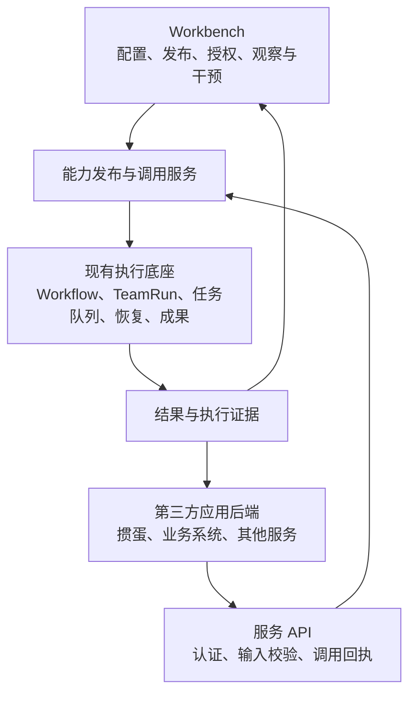

# Weave 已发布能力的服务调用层

日期：2026-09-12  
状态：产品演进方向与首版合同已确认；通用修复、共用准入和不可变发布合同已实现，调用 API、管理页面与业务迁移仍在实施。
配套：[分批实施计划](../计划/2026-09-12-已发布能力服务调用层分批实施计划.md)。

## 1. 决策与适用边界

Weave 增加已发布能力的服务调用层，让 Workbench 和第三方应用共用现有执行底座。核心方向是稳定应用身份、不可变能力版本、共用准入执行和业务侧最终提交。

这是对[当前产品合同](2026-09-05-Weave-当前产品合同.md)中“只为 Workbench 提供后端”的正式演进方向。Workbench 继续承担配置、发布、授权、观察与干预，第三方应用后端通过服务 API 调用已发布能力。Weave 不因此恢复独立业务 Console、业务 CLI 或独立 Codex/Claude 客户端产品路线。

本文件记录目标合同，不把现有掼蛋分支视为通用服务实现，也不把方案落档视为服务已开放。进入服务功能实施时，同批更新现行产品合同、根 AGENTS.md、入口说明和产品边界检查；迁移期间的其他限制继续适用。

首版保留单仓库、现有分层和 PostgreSQL，复用 Workflow、TeamRun、任务队列、恢复与成果机制。对外协议不绑定 Loom 或某个模型，不增加业务专属 Go 校验插件，不另建调度器或执行状态机。



Workbench 的既有任务派发也进入共用准入服务。已有任务无需人为转换成第三方应用调用；只有以已发布能力形式发起的请求才需要 Invocation。

## 2. 四个对外概念

| 概念 | 职责 | 关键约束 |
|---|---|---|
| 调用应用 `ServiceApp` | 稳定应用身份，归属一个 workspace | 凭据可轮换；应用 ID 不随密钥变化；创建管理员只作为管理审计信息 |
| 能力 `Capability` | 对外稳定名称，如“掼蛋出牌决策”“订单材料检查” | 第三方无需知道内部团队、Agent 和引擎组合 |
| 能力版本 `CapabilityRelease` | 绑定确切的已发布 Workflow、输入输出合同、执行限制和结果暴露范围 | 发布后不可变；更新模型、提示词、Workflow 或协议须发新版本 |
| 调用 `Invocation` | 记录应用、请求身份、能力版本、输入哈希及现有 run/task 的关联 | 是外部调用记录，执行状态以现有 TeamRun 为准 |

以上是业务概念，不要求刚好四张表。凭据、版本授权、提前取消标记和审计可以有独立存储，但不应形成第二套运行体系。

### 2.1 能力版本冻结什么

能力版本须绑定确切的 Workflow ID、版本与已发布 Artifact 内容哈希，并冻结输入输出合同及其校验器版本、输入映射、执行限制、超时规则和结果字段白名单。输入映射及玩家提示词属于发布物，不拼接在 HTTP handler 中。

模型、Agent 配置和依赖通过已发布 Artifact 固定；实施时验证这条依赖链是否完整，不能只保存 Workflow 的最新版本指针。运行时身份和实际引擎版本保留在执行证据中。供应商模型标识若不保证权重不可变，应明确这一外部边界，不把配置冻结称为输出可重复。

服务凭据不进入发布物；密钥轮换不产生新能力版本。能力的停用、撤销新调用资格属于独立控制信息，不修改已发布内容，也不删除历史回执。紧急撤权对历史读取和在途任务的影响须单独定义。

### 2.2 Invocation 的建议持久化字段

- 身份与归属：`workspace_id`、`app_id`、`invocation_id`、`request_id`。
- 冻结事实：`capability_id`、`release_id/version`、发布物哈希、规范化版本、输入及 `input_hash`、请求指纹、`concurrency_key`、接收与截止时间。
- 执行关联：`run_id`、`run_snapshot_id`、`task_id`。
- 审计与控制事实：本次认证的凭据 ID、来源记录、取消请求时间与原因。密钥原文不得保存于调用记录。

不在 Invocation 上维护独立的 `running/succeeded/failed` 可写状态链。查询从 TeamRun 与队列事实生成视图；尚未建立 TeamRun 时，表达持久化受理及排队事实，不伪造执行结果。

## 3. 应用身份、授权与隔离

应用身份与 API key 分开建模。服务调用使用明确的应用主体，例如 `principal.kind=service_app` 与稳定的 `app_id`；不把管理员写入执行主体的 `user_id` 来模拟用户派发。管理员身份只用于应用创建、授权和凭据管理审计。

授权表达为“某个应用可以调用某项能力的指定版本，可以查看和取消自己发起的调用，并受并发及用量限制”。初版建议显式授权版本，不使用会自动纳入未来版本的通配授权。

| 范围 | 稳定身份 |
|---|---|
| 幂等请求 | `workspace + app + request_id` |
| 业务串行范围 | `workspace + app + capability + concurrency_key` |
| 并发与用量额度 | 至少按 workspace、app 限制，必要时细分到 capability |

同一 workspace 的两个应用也不能互读、互取消。本地掼蛋和平台掼蛋注册为两个应用，不用不同密钥隐含地区分部署。所有回执和结果查询均从当前认证主体推导 workspace/app，不信任请求体提供的归属。

建议把“发起新调用”和“读取、取消既有调用”区分为权限。正常版本升级或撤销新调用授权不应导致历史回执漂移；凭据撤销后旧凭据立即失效，新凭据在同一应用授权范围内继续查询原调用。应用整体停用或紧急撤权的策略在实施前定稿。

### 3.1 首版权限生命周期

首版凭据分别授予 `invoke`、`read`、`cancel`。凭据撤销立即使该密钥的全部操作失效；轮换后同一应用的新凭据仍可按其 scope 读取或停止该应用的历史调用。能力、能力版本或版本授权停用只阻止新调用，已有调用继续执行并可由原应用读取、停止。应用整体停用属于紧急撤权，会使其全部服务凭据失效；管理员仍可从 Workbench 观察和停止在途调用。以上控制均保留发布版本、授权记录、调用回执与取消记录。

请求身份和提前取消记录首版不自动回收。授权撤销后如需重新开放同一版本，创建新的授权记录，旧调用继续引用原授权，不改写历史。

## 4. 共用准入与事务边界

将应用服务从 `echo.Context` 中提取出来，HTTP handler 负责认证、协议转换和错误映射。

| 入口 | 入口独有的责任 | 共用部分 |
|---|---|---|
| Workbench | 核验用户确认的任务输入、输入修订与会话/项目归属 | 发布物检查、快照创建、交付合同冻结、入队和回执 |
| 第三方应用 | 核验应用授权、能力版本与结构化输入 | 同一套发布检查、快照、队列及后续恢复 |

建议在 `internal/app` 下承载入口无关的准入应用服务和能力服务。共用服务依赖现有 `internal/kernel/workflow` 与 `internal/base` 存储，不让 kernel/base 反向认识 ServiceApp，也不让新服务导入 API 包。

建议暴露受控的事务内准入方法，调用方负责事务，准入方法不自行提交。Workbench 适配器可在同一事务消费确认输入；能力服务可在同一事务写入 Invocation。避免为了扩展性引入任意业务回调或通用插件注册框架。

### 4.1 首版受理顺序

1. 在有界请求体上完成认证、基本格式检查及输入规范化。事务内重新检查可能变化的应用状态、授权和版本准入状态。
2. 按稳定请求身份序列化提交与取消。若已有调用，按既有回执做幂等比对；若已有提前取消标记，拒绝新入队。
3. 对新请求检查能力版本、结构化输入、并发范围与用量，冻结被允许的发布物及执行限制。
4. 在同一 PostgreSQL 事务中写入调用记录、冻结版本关联、输入、运行快照、交付合同、队列任务，以及必要的额度占用。
5. 提交成功后返回已受理。模型执行在事务之外，由现有队列和执行底座承接。

已发布版本本身预先存在，第 4 步冻结的是本次调用使用的版本及事实。不能在每次调用时重新发布版本。

多进程正确性依靠数据库唯一约束和事务锁；进程内锁不足以保证。统一锁顺序，且不在数据库事务内等待模型、远端业务核验或人工操作。

两阶段 admission 并非一定错误，但需要持久化中间态、服务端恢复与收敛机制。当前记录和队列都在 PostgreSQL 中，首版采用单事务，减少受理后尚未入队的恢复分支。

### 4.2 外部来源与预运行窗口

服务调用必须正式进入运行审计。当前快照与数据库已允许 `api` 来源，可优先评估使用 `type=api`、`source_ref=invocation_id`，应用身份通过 Invocation 关联；也可以按定稿合同新增来源类型。无论采用哪种，准入校验、数据库约束、TeamRun 归属、队列来源及审计投影必须一致，不能标成 `manual` 或 `conversation_explicit`。

快照与队列提交后，TeamRun 可能尚未建立。首版要把这一窗口纳入取消、超时与并发占用统计：取消后不得启动模型；不能因查询不到 TeamRun 就释放并发名额或宣布执行已终止。具体实现复用队列的终态和取消机制，并验证与 worker 领取任务的竞争。

## 5. 业务知识的归属

| 掼蛋分支中的内容 | 提取后的归属 |
|---|---|
| 服务授权、幂等请求、提前取消、回执关联 | Weave 通用调用层 |
| 输入输出结构、大小和数量限制 | 能力版本的声明式合同，由 Weave 通用校验 |
| 玩家提示词、策略解释、输出格式、输入映射 | 已发布 Agent / Workflow 配置 |
| 牌局规则、合法候选生成、记牌推断 | 掼蛋业务服务 |
| 本体发布信息是否真实、输入事实是否正确 | 掼蛋或本体服务核验，Weave 冻结来源记录 |
| 返回候选是否仍合法、控制权和局面是否已变化 | 掼蛋权威提交逻辑 |

Weave 返回成功决策后，掼蛋仍检查当前局面、序列、控制版本和候选合法性，再提交出牌。输入哈希与来源记录只能说明本次使用了什么，不能证明外部事实真实或仍然有效。

第二个业务也遵守同一边界。比如订单材料检查由业务侧提供已核验的数据和材料，Weave 返回检查意见，正式订单变更和审批由业务系统执行。

## 6. 声明式合同与资源上限

当前 `machine/schema.go` 支持的可执行固定子集包括单字符串 `type`、`properties`、`required`、`additionalProperties`、`items`、`enum`、`const`；不支持的关键字会被拒绝。不能宣称支持完整 JSON Schema。

首版应命名并版本化这一合同方言，发布时拒绝未知关键字，运行输入与结果使用相同版本校验。现有内部 JSON 解码深度限制也不能直接当作公开服务的完整资源限制。

| 需要明确的限制 | 放置位置 |
|---|---|
| 请求体与结果总字节数、嵌套深度、对象字段数、数组项数、字符串长度 | 平台硬上限与能力版本中更小的声明式上限 |
| Schema 本身大小、节点数、深度、枚举规模、数字表示复杂度 | 通用校验器的有界解析规则 |
| 请求 ID、并发键长度与字符规则 | 服务协议 |
| 排队与执行的总截止时间、模型调用预算、输出预算 | 能力版本与执行底座 |
| 应用同时在途数、调用频率、累计用量 | 应用授权及额度记录 |

大小和数量限制可先作为合同的独立 `limits` 字段，不必伪装成当前不支持的 JSON Schema 关键字。需要字段级限制时，显式定义路径与语义。具体数值由两个样例的输入规模和业务等待时间确定，在对外开放前固定并验证。

输入哈希须使用已定义、已版本化的规范化规则，明确字段顺序、数字表示、重复键和非法数字的处理。不能直接把 `semanticJSONValue` 的比较键或 PostgreSQL JSONB 文本当作既有 Artifact 哈希算法。

## 7. 首版服务协议

```text
POST /v1/capabilities/{id}/versions/{version}/invocations
GET  /v1/invocations/{invocation_id}
POST /v1/invocations:cancel
```

提交包含 `request_id`、结构化 `input`，以及按能力配置启用的 `concurrency_key`。workspace/app 从认证主体获取。版本参数必须指向确切版本，首版不增加 `latest` 别名。

取消支持 `request_id`，可以补充支持 `invocation_id`；两者同时传入时必须指向同一调用。响应丢失后，应用可直接按请求身份取消。取消先于提交时，保存同一请求身份下的持久化取消标记，让迟到提交无法入队。

建议新调用持久化成功返回 HTTP 202 和稳定回执；幂等重放返回同一调用身份并标明 replay。回执至少包含请求/调用 ID、能力与版本、输入哈希、受理时间、截止时间和查询地址。具体 HTTP 状态码与错误码在协议定稿时统一。

### 7.1 必须成立的语义

| 情况 | 行为 |
|---|---|
| 相同请求身份、相同请求事实 | 返回同一次调用，不再入队；回执固定字段不变，查询进度可以更新 |
| 相同请求身份、更换输入 | 冲突，不覆盖输入，不产生新调用 |
| 相同请求身份、更换能力、版本或并发键 | 建议视为请求指纹冲突；需要新执行时使用新 request_id |
| 升级能力后重试原请求 | 返回原版本回执，不解析成最新版本，不重新执行当前发布准入 |
| HTTP 断开或调用方超时 | 不撤销已经持久化的任务；调用方可重试或主动取消 |
| 提交结果不明 | 用同一请求身份查询或重放；唯一约束保证最多一次入队 |
| 取消先到 | 持久化取消标记；之后同身份提交被挡住 |
| 已受理但尚无 TeamRun | 查询显示受理/队列事实，取消与超时仍能阻止模型启动 |
| 正在执行时取消或超时 | 记录持久化停止意图，由服务端驱动现有取消链路 |
| 已终态后再次取消 | 返回已存在的终态，不把成功历史改成已取消 |

幂等重放仍须验证当前凭据、应用归属和历史读取权限；“不重新执行发布准入”不等于绕过认证。重试原请求应先定位原记录，不能因最新能力配置变化而重新规范化旧请求、替换输入或创建新 run。

建议总截止时间从首次持久化受理计时，包含排队；重试不延长截止时间。到期原因与执行终态分开呈现。取消请求提交成功不代表执行进程已经退出；查询须区分取消已请求和终止已确认。晚到结果依靠现有运行代次、租约与终态约束处理，不覆盖终止事实。

取消标记、幂等身份和历史回执须有一致的保留策略。首版建议不自动回收请求身份；后续清理输入正文时保留最小去重事实，避免清理后同一请求再次执行。额度不足也不能妨碍应用取消已有任务。

### 7.2 结果与证据

外部查询使用专用返回结构，只暴露能力版本授权的结果字段和必要证据，如结果合同校验、输入/发布版本哈希、时间和有界用量信息。不能直接复用完整运行详情或原样返回底层异常。

内部提示词、私有输入、其他调用、工作目录和凭据均不随结果泄露。交付物链接也必须验证同一应用归属；字段白名单不能被链接绕过。

执行状态来自 TeamRun，结果可用性另行表达。TeamRun 成功但输出不满足合同，不得作为可用业务结果返回；保留执行成功事实并报告合同校验失败。不要为修饰服务响应改写 TeamRun 历史。

首版使用异步受理加查询。短等待只是体验优化；Webhook 后续增加，届时采用可重试、可去重的事件交付。

## 8. 执行范围与 Workbench 责任

首版只发布已验证的无工具计算类能力。发布检查须验证整个执行路径和引擎配置能够落实这一约束，仅配置 `deny=*` 不足以证明运行中没有工具。工具写入、人工审批和其他执行方式以后按能力版本逐项开放。

Workbench 应提供最小管理闭环：创建调用应用、签发与轮换凭据、从已发布 Workflow 发布能力版本、授予版本调用权限、观察调用与结果、请求停止，以及停用新调用。页面使用“调用应用”“能力版本”“调用记录”等业务名称，技术 ID 留在需要复制或排障的位置。

应用首次获得版本授权前，管理员应看到输入、输出、用途、执行范围、额度与超时。已有 Workbench 任务的确认、派发、恢复、停止、成果领取流程继续通过原有验收。

## 9. 逐步提取与完成标准

实施保持四批：先收回通用修复，再提取共用准入，然后增加能力发布与应用调用，最后迁移掼蛋并接入第二个不同业务。第一批可先独立推进；服务公开行为依赖协议、身份与数据约束先定稿。

提取成功须同时满足：

- 两个业务使用相同三个调用接口；第二个业务只新增应用配置、发布物和业务侧适配，不修改 Weave 核心路由或表结构。
- 密钥轮换后新密钥能查原调用；响应丢失后重试不重复入队；取消先到能挡住迟到请求。
- 能力升级后旧回执不漂移；不同应用互不可读、不可取消；结果及交付物无越权暴露。
- 服务端重启、worker 领取竞争、排队超时、执行中取消和晚到结果均收敛到可解释的事实。
- Workbench 原有流程继续通过实际页面验证。平台执行通过与两个业务的最终提交验收分别记证据。

批次依赖、来源提交、回退方式和验收矩阵见[实施计划](../计划/2026-09-12-已发布能力服务调用层分批实施计划.md)。

## 10. 本次核对到的代码事实

核对时间为 2026-09-12；主线为 `fda52f7b5611eef9362da9779fb2f253ec7fc53f`，掼蛋分支为 `5820abdde9335fa5e41e2ce66a6be9e630ff7749`。以下是源码核对，不代表本轮运行验收。

| 当前事实 | 代码依据 | 对实施的影响 |
|---|---|---|
| API key 的拥有者进入 `user_id` | [`setAPIKeyContext`](../../internal/app/api/middleware.go) | 增加应用主体，保留已有用户入口语义 |
| 快照、交付合同、入队与确认输入消费处于同一事务，但使用 Echo 上下文 | [`admitTeamWorkflowDispatch`](../../internal/app/api/workflow_manual_run.go) | 可作为共用准入提取基础；需显式化上下文中的幂等与归属信息 |
| 内核已有事务内发布物及实时准入检查，手动入口仅接受默认或会话来源 | [`AdmitWorkflowManualRunTx`](../../internal/kernel/workflow/manual_admission.go) | 复用检查机制，扩展真实调用来源，不复制整套检查 |
| 快照、准入拒绝和 TeamRun 数据约束已有 `api` 来源 | [0063 migration](../../internal/base/db/migrations/0063_manual_workflow_trigger.sql)、[snapshot store](../../internal/base/snapshot/store.go) | 优先确认能否沿用；不要误判为必须新增一整套来源枚举 |
| 现有取消服务先锁定 TeamRun，队列有事务内取消方法 | [CancelService](../../internal/base/teamrun/workers.go)、[taskqueue store](../../internal/base/taskqueue/store.go) | 需补齐 TeamRun 建立前的取消接入和竞争验证 |
| Schema 是显式固定子集；比较键不是 Artifact 哈希输入 | [machine schema](../../internal/kernel/workflow/machine/schema.go)、[JSON decode](../../internal/kernel/workflow/machine/decode.go) | 公开合同应声明方言，增加资源上限并定义规范化版本 |
| 产品检查仍约束退役入口，根指南仍禁止迁移期新增产品功能 | [AGENTS.md](../../AGENTS.md)、[product guard](../../tools/product/check_product_boundary.py) | 服务边界实施批同步调整正向授权范围，继续拦截退役入口 |

掼蛋分支中的 `game_decisions.go` 以 `api_key_id` 绑定和去重，先写 admission 再进入派发事务，并在 handler 中拼接业务提示词。它提供可参考的故障场景和修复来源，通用层需重新确定身份、事务和业务归属。
