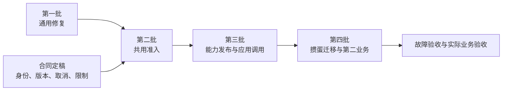

# 已发布能力服务调用层分批实施计划

日期：2026-09-12  
状态：执行分析草案；本轮完成方案落档与源码盘点，以下实现和验收均尚未执行。  
目标边界：[Weave 已发布能力的服务调用层方案](../架构/2026-09-12-Weave已发布能力服务调用层方案.md)。

## 1. 执行判断

保持四批提取，在服务功能开发前增加一次合同定稿。第一批通用修复可以独立回收；后面的关键路径是共用事务准入、稳定应用身份、冻结能力版本、完整调用协议，最后才是业务切换。

不建议从三个服务路由开始开发。路由背后的幂等、取消、版本与权限边界尚未固定，先写 handler 容易再次把掼蛋协议装入通用名称。也不建议先做完整能力市场或大量管理页面；先闭合两个样例真正需要的发布、授权、调用和观察路径。

每批完成后产生可独立评审的提交和验证记录，再进入下批。批次完成按行为与证据判断，不用文件数量或接口存在代替完成。

## 2. 当前基线与集成方式

本次只读核对发现：

- 主工作树 `/Users/jinyitao/Developer/weave-next` 位于 `main`，HEAD 为 `fda52f7b5611eef9362da9779fb2f253ec7fc53f`。
- 来源工作树 `/Users/jinyitao/Developer/weave-next-guandan-ai` 位于 `codex/guandan-ai-player-20260910`，HEAD 为 `5820abdde9335fa5e41e2ce66a6be9e630ff7749`，核对时干净。
- 来源分支比主线多 7 个提交，差异涉及 24 个文件；主工作树已有其他部署工作的未跟踪文件，本次不纳入方案改动。

正式实施时重新核对 HEAD 与工作树状态，为各批创建 `codex/` 前缀分支及独立工作树。来源分支只按确切提交读取，不混入其部署脚本、业务路由和掼蛋数据表。通用修复跨越业务提交时按改动提取，形成新的可审查提交；记录来源 SHA、提取范围及舍弃原因。

以下提交仅用于定位候选改动，尚未证明可直接合入或已经通过本轮测试。

## 3. 合同定稿：在服务数据结构落地前解决

| 事项 | 建议起点 | 定稿产物 |
|---|---|---|
| 产品边界 | Workbench 负责管理和原有任务；应用后端只调用已发布版本 | 对当前产品合同、AGENTS.md、README 与 productguard 的具体修改清单 |
| 请求身份 | workspace/app/request_id 唯一；能力、版本、并发键也进入请求指纹 | 提交、重放、冲突的请求/响应样例 |
| 提前取消与历史保留 | 按相同请求身份保存取消标记；首版不自动释放请求身份 | 提交/取消竞争顺序与数据保留约束 |
| 权限生命周期 | 发起新调用与历史读取/取消分开；密钥轮换不换应用 | 授权、停用、撤权对新调用、在途和历史的行为表 |
| 来源 | 优先评估 `api + invocation_id`，关联应用审计 | 从 handler、准入到队列、快照、TeamRun 的字段映射 |
| 合同方言 | 使用明确子集与独立 limits，未知关键字拒绝 | 支持/不支持表、规范化规则、可执行大小边界样例 |
| 超时与额度 | 首次受理起算总截止时间；重放不占新额度、不续期 | 两个样例的限额配置及服务端执行方式 |
| 第二个业务 | 建议“订单材料检查”，限于结构化材料和检查意见 | 确切输入、输出、调用方、审核者与业务侧提交规则 |

本轮用户已确定通用服务方向；这里需要定稿的是实现合同。第二业务、资源上限及权限生命周期仍是建议，不能写成已经选定或实现。第一批通用修复不依赖这些业务参数。

定稿评审分别检查产品价值与操作路径、工程事务与分层、质量故障与隔离。评审应逐项记录结论、未决项及依据，本轮源码核对不冒充独立互审。

## 4. 第一批：独立收回通用修复

产物是四个尽量独立的修复提交或 PR，不增加服务路由和产品范围。

| 切片 | 来源与代码范围 | 验收重点 | 依赖或剔除项 |
|---|---|---|---|
| 1A Agent 配置更新 | `809324f8` 中 `internal/app/api/agents.go` 与相关测试 | `tool_loop_control` 省略时保留、显式提供时更新；已有模型选择与其他配置更新语义不回退 | 不带入要求掼蛋使用特定引擎/模型的逻辑 |
| 1B 输出 schema 传递 | `136afc20` 中 `internal/kernel/runtimes/exec.go` | 显式输出 schema 优先；缺省时是否正确使用 Agent 的冻结 schema；本地与远端 payload 一致 | 新增有意义的优先级与传播回归用例，确认不会重新读取可变配置 |
| 1C Codex MCP 工作目录 | `27fdf123`、`571fff2e` 中 engine 及 fixture 改动 | 探测与执行使用同一工作目录；隔离测试参数文件，不污染工作树 | `DisableTools` 字段来自 `136afc20`，插件配置相关改动不能脱离依赖盲目 cherry-pick |
| 1D Loom 取消修复 | `809324f8` 中 `member_journal.go` 与 PG 测试 | 取消导致第二次 BeginTx 失败时不因延迟回滚解引用错误事务；旧代次/取消后不得补写执行收据 | 与掼蛋专属发布约束拆开；现有防护与本次新增行为分别验证 |

1C 可先提取纯工作目录修复；无工具执行配置归入第三批的发布准入验证。需要时把相关通用引擎支持作为明确依赖收回，不顺带扩展为所有引擎都已支持无工具模式。

验证先覆盖受影响包及必要 PostgreSQL 回归，集成批次运行 `make test`、`make depguard`、`make productguard`。真实 PG 用例必须实际执行，不能把环境缺失导致的 skip 记为通过。此批无 Workbench 改动时不为它新增界面测试。

完成条件：四个修复各有前后行为证据和干净提交；主线继续满足原合同。此时仍不宣称通用调用服务可用。

## 5. 第二批：共用准入服务，保持 Workbench 行为

建议先做一个受控重构 PR，必要时将机械提取和适配拆成两个连续提交。

| 工作 | 具体落点 |
|---|---|
| 显式化准入输入与回执 | 替代 Echo 中的 run/task ID、fingerprint、主体与归属隐式字段 |
| 提取事务内应用服务 | 从 `workflow_manual_run.go` 抽出发布检查、快照、交付合同和入队；调用方持有事务 |
| 保留 Workbench 入口检查 | 输入修订锁定与消费、用户确认、会话/项目归属留在 Workbench 适配层，并保持原子提交 |
| 保留共用执行校验 | 复用 `AdmitWorkflowManualRunTx` 的发布物与实时授权检查，避免复制 SQL 与发布判断 |
| 错误与审计 | 使用入口无关的领域错误；HTTP 状态和 Workbench 文案由适配器转换 |

这一批不要求新建 ServiceApp 表，也不把 Workbench 输入确认降级为普通字符串。共用准入应有 typed request 和 receipt，不做“传一组任意钩子”的抽象。

验收包含确认输入相同重放、不同事实冲突、发布物不合法拒绝、事务任一步失败全部回滚，以及原有项目/会话归属和交付合同不变。参考现有 `workflow_team_dispatch_pg_test.go`、派发与交付相关 PG 用例，并在 Workbench 实际完成一次确认、派发、停止/恢复及成果领取。

完成条件：Workbench 已使用共用准入，行为与回执兼容；应用服务不依赖 Echo，调用方可将自己的记录加入同一事务。没有第二份调度或恢复逻辑。

## 6. 第三批：能力发布与应用调用

这一批包含三个连续、可审查的切片。三个切片全部通过后，才算首版服务闭环；中间切片是实施进度，不是对外可用版本。

### 3A 应用、版本与发布合同

增加稳定应用主体、可轮换凭据、能力与不可变版本、版本授权、调用记录和提前取消记录。使用复合 workspace/app 归属约束，版本引用不可漂移。凭据管理复用已有可靠机制，服务身份与权限边界显式区分于用户 API key。

实现合同子集与资源上限、请求规范化、发布物绑定、无工具执行范围检查，以及结果字段白名单。同步更新产品合同、AGENTS.md、入口说明和产品边界检查，继续禁止退役业务入口。

数据迁移采用增量方式，编号在集成时按主线重新分配。不要直接使用来源分支的掼蛋表名和迁移编号。停止新调用、切换应用版本授权或回退程序时，保留历史发布物、Invocation 与请求去重事实。

### 3B 原子提交、查询与停止

增加三个服务接口，调用第二批共用准入。一次事务提交 Invocation、输入与版本关联、快照、交付合同、队列和额度占用。调用失败不得留下已受理但无法恢复的半成品。

取消与提交使用同一请求身份序列化；有 TeamRun 时复用现有 CancelService，无 TeamRun 时与队列领取共同保证不启动模型。服务端持久化截止时间并在重启后继续驱动超时取消。恢复巡检只修复调用关联和控制意图，执行恢复仍由现有队列/TeamRun 负责。

查询使用专用 DTO，分开显示执行状态和结果可用性。所有结果及交付物访问执行应用归属检查，取消和查询保留足够处理容量，不因新调用额度耗尽而失效。

### 3C Workbench 管理闭环

提供创建应用、签发/轮换凭据、发布能力版本、授权指定版本、查看调用、查看允许结果及请求停止的最小页面路径。能力停用仅影响哪些行为必须与合同一致；发布页面应让管理员知道应用能提交什么、收到什么和执行限制。

运行 `make workbench-install workbench-check`，并实际操作上述路径。服务 API 通过不能代替 Workbench 管理流程通过；静态配置脚本也不能作为最终的管理入口验收。

第三批完成条件：下文 F01–F14 故障及边界用例通过，管理闭环和原有 Workbench 流程通过；完成增量迁移和服务端/worker 重启 readback。公开接口不带掼蛋字段或特定模型要求。

## 7. 第四批：迁移掼蛋，再接第二业务

### 4A 掼蛋迁移

把业务提示词、策略说明和输出约束移入发布物，把牌局规则、候选生成、记牌及来源真实性验证留在掼蛋。适配器只负责提交结构化输入、查询或取消、读取授权结果。

本地和平台部署注册为两个 ServiceApp。测试密钥轮换与隔离，并在实际业务提交处验证 sequence、控制版本、局面和候选合法性。过期结果应被拒绝且留下可解释原因。

先在隔离任务中演练，再切换新请求。切换点明确哪些请求由旧接口受理，禁止同一业务请求同时向新旧入口提交。若已有旧调用在途，保留旧查询/取消路径直至收敛；是否迁移历史记录按实存数据盘点决定，不默认复制业务表进通用模型。必要时提供一次性的业务侧适配，不长期保留 Weave 内部的掼蛋核心路由。

### 4B 第二个业务

建议使用订单材料检查，与实时游戏形成明显差异：输入是订单摘要、材料清单和业务侧确认的来源，输出是缺项、矛盾与待人工确认项；不自动修改订单或审批结果。缺失字段等确定性业务校验仍由业务服务处理。

具体业务尚待讨论。无论选哪个，第二业务接入期间只允许增加配置、发布物、验证材料和业务侧适配。若必须修改 Weave 核心路由或表结构，说明通用合同有缺口，回到第三批修订并重新验收两个业务。

完成条件：两个业务分别使用真实材料，完成调用、异常处理和业务侧最终采纳/拒绝；保存平台执行证据与业务验收记录，不把模型 JSON 合法等同于业务任务成功。

## 8. 统一验收矩阵

以下均为计划用例，本轮没有执行结果。测试记录须包含确切 SHA、输入/版本身份、故障位置、数据库读回、API 返回与必要页面证据。

| 编号 | 场景 | 通过判据 |
|---|---|---|
| F01 | 密钥轮换 | 新密钥可读原调用；旧密钥失效；同请求不会变成新调用 |
| F02 | 响应丢失、客户端断开与多进程重试 | 恢复同一 invocation/run/task；最多一次入队 |
| F03 | 同请求更换输入、版本或并发键 | 明确冲突；原记录和冻结事实不变 |
| F04 | 取消先于提交、重复取消、取消与提交并发 | 持久化停止意图；先到取消挡住迟到入队；顺序可解释 |
| F05 | 已入队而 TeamRun 未建立时取消 | worker 竞争与进程重启后均不启动模型，不假报终止 |
| F06 | 任一受理写入失败、COMMIT 结果不明 | 原子回滚或通过重放找回唯一已提交调用，无半受理记录 |
| F07 | 发布新版本、修改 Agent/模型配置 | 旧请求重放及原执行仍绑定原发布物，新请求使用显式新版本 |
| F08 | 同 workspace 跨应用、跨 workspace 访问 | 查询、取消、交付物、错误信息均不泄露或越权 |
| F09 | 并发键与应用额度竞争 | 排队到终态前占用准确；重放不重复扣额，重启无泄漏或超卖 |
| F10 | 排队超时、执行超时、取消后晚到结果 | 服务端持续驱动，取消请求与终态分开，晚到结果不覆盖终态 |
| F11 | 输入/输出超限、未知 schema 关键字、无效模型结果 | 有界拒绝或明确结果不可用，不误报可交付成功 |
| F12 | 应用/版本停用、授权撤回 | 新调用、历史读取、取消、在途执行严格符合定稿生命周期表 |
| F13 | 服务端及 worker 中断后恢复 | 持久化调用与控制意图仍可读，复用既有恢复，不创建新逻辑执行 |
| F14 | 无工具能力和结果暴露 | 实际支持的引擎不能调用未授权工具；私有输入、提示词、路径及凭据不外泄 |
| B01 | Workbench 原有旅程与新增管理旅程 | 实际页面确认、发布、授权、观察、干预和领取成果均可完成 |
| B02 | 掼蛋控制权切换或局面推进后结果返回 | 业务侧拒绝过期结果，不自动出牌 |
| B03 | 第二业务接入 | 相同服务协议，核心路由/表结构无业务增量，结果由业务侧审核或提交 |

工程集成按变更范围执行 `make test`、`make depguard`、`make productguard`，必要时 `make ci`；Workbench 变更执行仓库固定 pnpm 的安装与检查。真实 PostgreSQL 验证使用独立测试库，平台联调使用 `docker-compose.platform.yml`。不要使用 `go test ./...` 替代仓库约定范围，也不为纯文档改动跑完整业务测试。

## 9. 依赖、回退与推进纪律

共享接点包括 `api/middleware.go`、`workflow_manual_run.go`、`team_dispatch.go`、`workflow/manual_admission.go`、snapshot/taskqueue/teamrun 数据约束和 Workbench 调用视图。同一接点按依赖顺序集成，避免身份、来源和事务三处同时分叉。

第一批中独立修复可以分支分开验证；后续业务适配只有在服务协议冻结后才适合独立开展。每个分支只集成已审查的确切 SHA。执行中若主线发生变化，重新核对差异而不覆盖别的任务内容。

回退优先停止新调用、撤销新版本授权或切回已验证版本，原调用继续按原版本查询和收敛。能力版本不可原地改写，数据库回退不能删除历史回执或取消标记。用户侧重试沿用原请求身份，禁止用回退制造重复业务执行。

本次最合适的下一步是把第一批四个修复的提取范围与验证用例做成具体改动，同时讨论第 3 节的合同表，随后再提取共用准入。首个阶段性成果应是“通用修复已独立集成、Workbench 行为未变”，而非“服务路由已经存在”。
